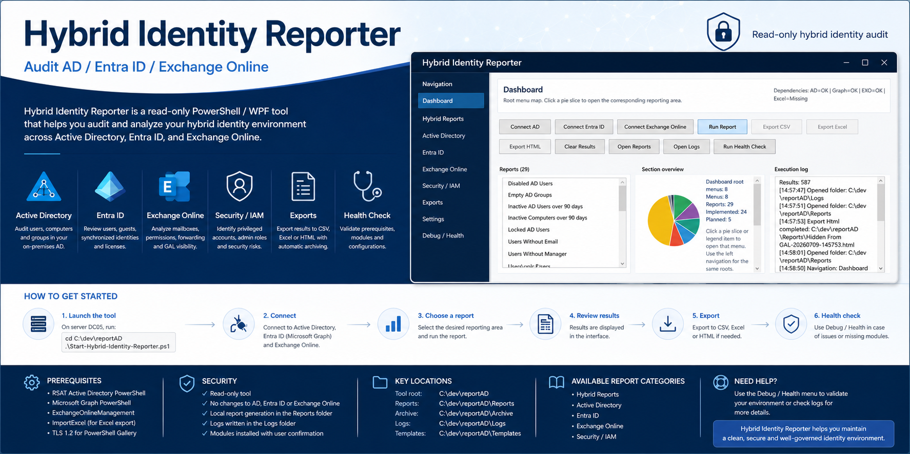

# Hybrid Identity Reporter



Hybrid Identity Reporter is a read-only PowerShell/WPF audit tool for hybrid identity environments:

- Active Directory on-premise
- Entra ID / Microsoft Graph
- Entra Connect synchronized identities
- Exchange Online recipients and mailboxes

This version implements the main read-only audit reports and provides a modular structure for future reports.

## Prerequisites

- Windows workstation or admin server
- PowerShell 7 recommended, Windows PowerShell 5.1 supported for WPF
- Network access to domain controllers
- Appropriate read-only permissions in Active Directory, Entra ID and Exchange Online
- For AD reports, RSAT Active Directory PowerShell tools must be installed

## Required PowerShell Modules

Install from an elevated PowerShell session when needed:

```powershell
[Net.ServicePointManager]::SecurityProtocol = [Net.ServicePointManager]::SecurityProtocol -bor [Net.SecurityProtocolType]::Tls12
Install-PackageProvider -Name NuGet -MinimumVersion 2.8.5.201 -Scope CurrentUser -Force -Confirm:$false
if (-not (Get-PSRepository -Name PSGallery -ErrorAction SilentlyContinue)) {
    Register-PSRepository -Default
}
Set-PSRepository -Name PSGallery -InstallationPolicy Trusted
$installModuleParams = @{
    Scope = 'CurrentUser'
    Repository = 'PSGallery'
    Force = $true
    AllowClobber = $true
    Confirm = $false
}
if ((Get-Command Install-Module).Parameters.ContainsKey('AcceptLicense')) {
    $installModuleParams.AcceptLicense = $true
}
Install-Module Microsoft.Graph @installModuleParams
Install-Module ExchangeOnlineManagement @installModuleParams
Install-Module ImportExcel @installModuleParams
```

Install RSAT Active Directory tools on Windows client:

```powershell
Get-WindowsCapability -Online -Name Rsat.ActiveDirectory* 
Add-WindowsCapability -Online -Name Rsat.ActiveDirectory.DS-LDS.Tools~~~~0.0.1.0
```

The first command is a safe inventory command. The second command installs RSAT and requires administrative rights.

The GUI also checks dependencies at runtime. When a required module is missing, it prompts before installing:

- Microsoft Graph modules: `Install-Module -Scope CurrentUser`
- Exchange Online module: `Install-Module -Scope CurrentUser`
- ImportExcel module: `Install-Module -Scope CurrentUser`
- Active Directory tools: RSAT installation through `Install-WindowsFeature` on Windows Server or `Add-WindowsCapability` on Windows client

No module or Windows capability is installed without user confirmation.

The tool enables TLS 1.2 for the current PowerShell session before using PowerShell Gallery. This is required on many Windows PowerShell 5.1 systems for `Install-Module`, NuGet and PSGallery access.

Installations are displayed in a dedicated progress window with:

- current status
- indeterminate progress bar
- execution log
- success confirmation
- error details when installation fails

## Configuration

Edit `Config/connections.json` before first use if you need tenant-specific or domain-specific settings:

- `ActiveDirectory.Server`: optional domain controller FQDN
- `ActiveDirectory.SearchBase`: optional OU/domain DN search base
- `MicrosoftGraph.TenantId`: optional tenant ID
- `ExchangeOnline.UserPrincipalName`: optional admin UPN

All implemented functions are read-only. This version does not call `Set-ADUser`, `Set-Mailbox`, `Update-MgUser`, or any corrective command.

## Launch

From the project folder:

```powershell
.\Start-Hybrid-Identity-Reporter.ps1
```

If the script is started in a non-STA PowerShell session, it relaunches itself with STA because WPF requires it.

The folder is portable. You can copy the full project directory anywhere under `C:\` and launch the tool from the copied folder. Paths are resolved from the script location, not from a hard-coded development path.

## Connections

Use the top buttons in the application:

- `Connect AD`: imports `ActiveDirectory` and validates the domain connection with `Get-ADDomain`.
- `Connect Entra ID`: runs `Connect-MgGraph` with minimum read scopes from `Config/connections.json`.
- `Connect Exchange Online`: runs `Connect-ExchangeOnline`.

Connection status is displayed in the bottom status bar and actions are logged in `Logs`.

## Navigation

The left menu filters the report catalog by area. The Dashboard is the root view: its pie chart represents the main menus and each slice opens the matching section.

- Dashboard: root menu map with clickable pie chart
- Hybrid Reports: cross-platform AD / Entra / Exchange checks
- Active Directory: AD user, group and computer reports
- Entra ID: Microsoft Graph user reports
- Exchange Online: mailbox and recipient reports
- Security / IAM: privileged access and identity hygiene reports
- Exports: export-oriented view
- Settings: configuration guidance
- Debug / Health: local diagnostics, log/report folder shortcuts and dependency checks

Reports marked `(planned)` are visible in the catalog but are intentionally not executable yet.

## Debug / Health

Use `Run Health Check` to validate local prerequisites without changing AD, Entra ID or Exchange Online. It checks:

- PowerShell version and STA mode
- TLS 1.2 session status
- required module presence
- project folders
- JSON configuration files
- report catalog and implemented function mapping
- portability/root folder information
- connection-state suggestions for Graph and hybrid reports

You can also run the same project-level validation from PowerShell before delivery:

```powershell
.\Tools\Test-HIRProject.ps1
```

## Implemented Priority Reports

- Disabled AD Users
- Disabled AD users still visible in GAL
- Cloud-only Entra users
- Guest Entra users
- Mailboxes with forwarding enabled
- Locked AD Users
- Inactive AD Users over 90 days
- Password Never Expires
- Domain Admins Members
- AdminCount = 1 Users
- Users Without Email
- Users Without Manager
- Inactive Computers over 90 days
- Empty AD Groups
- Synced Users
- Disabled Entra Users
- Licensed Users
- Users Without License
- Entra Groups
- Entra Admin Role Members
- User Mailboxes
- Shared Mailboxes
- Hidden From GAL
- AD users missing mailNickname
- AD users missing proxyAddresses

The report catalog is defined in `Config/reports.json`. Add future reports there after adding the matching function in the relevant `.psm1` module.

## Export Reports

After running a report, use:

- `Export CSV`
- `Export Excel`
- `Export HTML`

Exports are written to `Reports` and include:

- Report name
- Execution date
- Result count
- Report data

Excel export requires the `ImportExcel` module.

## Logs

Logs are written to `Logs\Hybrid-Identity-Reporter-yyyyMMdd.log`.

Each line contains:

- Date
- Module
- Action
- Level: INFO, WARNING, ERROR
- Message

The GUI trims very long on-screen logs to reduce memory usage during long sessions. File logs remain the source of truth.

## Runtime Stability

Runtime safeguards are configured in `Config/appsettings.json`:

- `Runtime.InstallTimeoutMinutes`: stops a dependency installation job after the configured timeout.
- `Runtime.MaxUiLogCharacters`: limits text retained in WPF text boxes.
- `Runtime.LargeResultWarningThreshold`: logs a warning when a large result set is loaded into the grid.

The application also includes:

- single-operation guard to prevent double-click duplicate executions
- busy cursor and disabled action buttons during long actions
- cancellation button for dependency installation jobs
- forced cleanup of installation jobs in `finally`
- cleanup of WPF item sources and in-memory results when the main window closes
- visible STA relaunch when the script is started from a non-STA shell
- internal function prefix normalized to `HIR`

## Project Layout

```text
Hybrid-Identity-Reporter/
|-- Start-Hybrid-Identity-Reporter.ps1
|-- Config/
|-- GUI/
|-- Modules/
|   |-- Core/
|   |-- AD/
|   |-- Entra/
|   |-- Exchange/
|   |-- Hybrid/
|   `-- Export/
|-- Reports/
|-- Archive/
|-- Logs/
`-- Templates/
```

## Future Improvements

- Add report archive rotation based on `Config/appsettings.json`.
- Add asynchronous report execution to keep the WPF UI responsive during long tenant queries.
- Add application settings UI and a dedicated dependency health page.
- Add Graph MFA method report using Microsoft Graph authentication methods endpoints.
- Add optional signed script and internal code-signing workflow.
